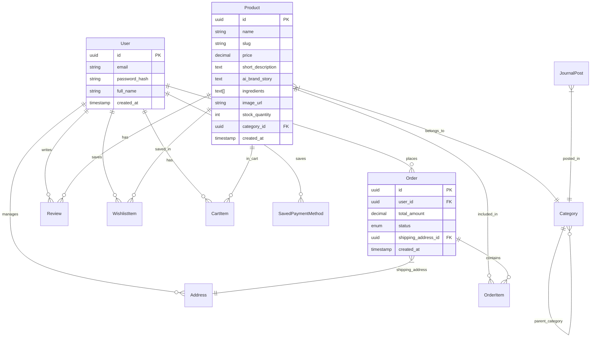

# Yara Lane Database Schema

## Overview

This schema is designed for a relational database (PostgreSQL recommended) to support the Yara Lane e-commerce platform. It handles user authentication, product catalog management, order processing, content management (journal), and user preferences (addresses, payment methods).

## Entity Relationship Diagram (Mermaid)

## Tables

### 1. Users & Authentication

| Column Name | Data Type | Constraints | Description |
|---|---|---|---|
| `id` | UUID | PK, Default: `gen_random_uuid()` | Unique user identifier |
| `email` | VARCHAR(255) | Unique, Not Null | User email address |
| `password_hash` | VARCHAR | Not Null | Hashed password (e.g., Argon2) |
| `full_name` | VARCHAR(100) | Not Null | Display name for reviews/emails |
| `role` | VARCHAR(20) | Default: 'customer' | 'customer', 'admin' |
| `created_at` | TIMESTAMPTZ | Default: NOW() | Account creation time |

### 2. Products & Catalog

| Column Name | Data Type | Constraints | Description |
|---|---|---|---|
| `id` | UUID | PK, Default: `gen_random_uuid()` | Unique product identifier |
| `category_id` | UUID | FK -> Categories(id) | Product category linkage |
| `name` | VARCHAR(255) | Not Null | Product display name |
| `slug` | VARCHAR(255) | Unique, Not Null | URL-friendly identifier |
| `price` | DECIMAL(10,2) | Not Null, Check >= 0 | Unit price |
| `short_description`| TEXT | Not Null | Standard marketing copy |
| `ai_brand_story` | TEXT | Nullable | Generated narrative (Gemini API) |
| `ingredients` | TEXT[] | Default: `{}` | Array of key materials/ingredients |
| `images` | JSONB | Default: `[]` | Array of image URLs (Main + Gallery) |
| `stock_quantity` | INTEGER | Default: 0 | Inventory tracking |
| `rating_avg` | DECIMAL(3,2) | Default: 0 | Cached average rating |
| `review_count` | INTEGER | Default: 0 | Cached review count |
| `is_active` | BOOLEAN | Default: true | Soft delete/hide flag |

### 3. Categories

| Column Name | Data Type | Constraints | Description |
|---|---|---|---|
| `id` | UUID | PK | Unique category ID |
| `parent_id` | UUID | FK -> Categories(id), Nullable | For nested categories (e.g. Skincare -> Serums) |
| `name` | VARCHAR(100) | Not Null | e.g., "Skincare", "Fragrance" |
| `slug` | VARCHAR(100) | Unique | URL slug |
| `type` | ENUM | 'product', 'journal' | Distinguish product vs blog categories |

### 4. Reviews

| Column Name | Data Type | Constraints | Description |
|---|---|---|---|
| `id` | UUID | PK | Unique review ID |
| `product_id` | UUID | FK -> Products(id) | The product being reviewed |
| `user_id` | UUID | FK -> Users(id) | The reviewer |
| `rating` | INTEGER | Not Null, Check 1-5 | Star rating |
| `comment` | TEXT | Nullable | Review text content |
| `is_verified` | BOOLEAN | Default: false | True if user purchased item |
| `created_at` | TIMESTAMPTZ | Default: NOW() | Review timestamp |

### 5. Wishlist (Join Table)

| Column Name | Data Type | Constraints | Description |
|---|---|---|---|
| `user_id` | UUID | PK, FK -> Users(id) | User owner |
| `product_id` | UUID | PK, FK -> Products(id) | Saved product |
| `added_at` | TIMESTAMPTZ | Default: NOW() | When it was saved |

### 6. Cart (Persistent)

| Column Name | Data Type | Constraints | Description |
|---|---|---|---|
| `id` | UUID | PK | Unique cart item entry |
| `user_id` | UUID | FK -> Users(id) | Cart owner |
| `product_id` | UUID | FK -> Products(id) | Product in cart |
| `quantity` | INTEGER | Default: 1, Check > 0 | Number of items |
| `updated_at` | TIMESTAMPTZ | Default: NOW() | For cart expiry logic |

### 7. Orders

| Column Name | Data Type | Constraints | Description |
|---|---|---|---|
| `id` | UUID | PK | Unique order ID |
| `user_id` | UUID | FK -> Users(id) | Customer |
| `status` | ENUM | 'pending', 'paid', 'shipped', 'delivered', 'cancelled' | Order lifecycle state |
| `total_amount` | DECIMAL(10,2) | Not Null | Final charge amount |
| `shipping_address_id` | UUID | FK -> Addresses(id) | Snapshot or link to address |
| `payment_intent_id`| VARCHAR | Nullable | Stripe/Payment Gateway ID |
| `created_at` | TIMESTAMPTZ | Default: NOW() | Order placement time |

### 8. Order Items

| Column Name | Data Type | Constraints | Description |
|---|---|---|---|
| `id` | UUID | PK | Unique line item ID |
| `order_id` | UUID | FK -> Orders(id) | Parent order |
| `product_id` | UUID | FK -> Products(id) | Snapshot of product |
| `price_at_purchase`| DECIMAL(10,2) | Not Null | Price snapshot (handles price changes) |
| `quantity` | INTEGER | Not Null | Quantity purchased |

### 9. Addresses

| Column Name   | Data Type | Constraints         | Description                       |
|--------------|-----------|---------------------|-----------------------------------|
| `id`         | UUID      | PK                  | Unique address ID                 |
| `user_id`    | UUID      | FK -> Users(id)     | Address owner                     |
| `type`       | ENUM      | 'Billing', 'Shipping'| Address classification            |
| `first_name` | VARCHAR   | Not Null            | Recipient First Name              |
| `last_name`  | VARCHAR   | Not Null            | Recipient Last Name               |
| `line1`      | VARCHAR   | Not Null            | Street address                    |
| `line2`      | VARCHAR   | Nullable            | Apartment, suite, etc.            |
| `city`       | VARCHAR   | Not Null            | City                              |
| `postal_code`| VARCHAR   | Not Null            | ZIP/Postal Code                   |
| `country`    | VARCHAR   | Not Null            | Country name                      |
| `is_default` | BOOLEAN   | Default: false      | Marks this address as user's default for its type |

### 10. Saved Payment Methods

| Column Name                | Data Type | Constraints         | Description                                 |
|---------------------------|-----------|---------------------|---------------------------------------------|
| `id`                      | UUID      | PK                  | Unique identifier                           |
| `user_id`                 | UUID      | FK -> Users(id)     | Payment method owner                        |
| `stripe_payment_method_id`| VARCHAR   | Unique, Not Null    | Token from Payment Gateway                  |
| `brand`                   | VARCHAR   | Not Null            | e.g. 'Visa', 'Mastercard', 'Amex'           |
| `last4`                   | VARCHAR(4)| Not Null            | Last 4 digits for display                   |
| `expiry_month`            | INTEGER   | Not Null            | Expiry Month                               |
| `expiry_year`             | INTEGER   | Not Null            | Expiry Year                                |
| `is_default`              | BOOLEAN   | Default: false      | Marks this payment method as user's default |

### 11. Journal Posts (Editorial)

| Column Name | Data Type | Constraints | Description |
|---|---|---|---|
| `id` | UUID | PK | Unique post ID |
| `title` | VARCHAR | Not Null | Article title |
| `slug` | VARCHAR | Unique, Not Null | URL-friendly slug |
| `excerpt` | TEXT | Not Null | Short summary for cards |
| `content` | TEXT | Not Null | Full article content (Markdown/HTML) |
| `image_url` | VARCHAR | Not Null | Featured image |
| `category` | VARCHAR | Not Null | e.g. 'Lifestyle', 'Rituals' |
| `published_at` | TIMESTAMPTZ | Default: NOW() | Publication date |
| `read_time` | VARCHAR | Default: '5 min' | Estimated read time |

## Performance Considerations

1.  **Computed Ratings**: `rating_avg` and `review_count` on `Products` table should be updated via triggers when rows are added to `Reviews`.
2.  **Full Text Search**: Enable PostgreSQL `tsvector` on `Products.name`, `Products.short_description` and `JournalPosts.title` for performant search.
3.  **JSONB**: Used for `images` to allow flexibility without a separate table for product galleries.
4.  **Security**: `SavedPaymentMethods` must NEVER store full card numbers or CVCs, only the gateway token and display metadata (last4/expiry).
